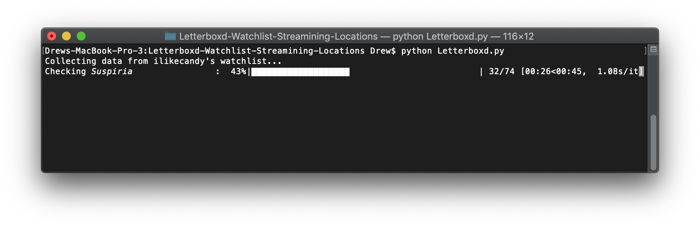
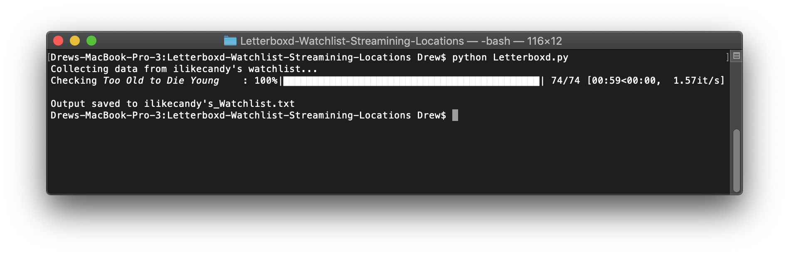

# Letterboxd Watchlist Streaming Locations
Python script that finds where Letterboxd users can stream films on their watchlist. 

The script includes a progress bar that shows how far along it is and how long it expects to take:


It saves output to the current directory once completed:


NOTE: Make sure your console is large enough to accomodate for the progress bar. Otherwise, instead of updating the bar with every new film, it outputs a new progress bar, filling up the console and ruining my beautiful formatting.

### Making Sense of the Output
The output starts with some basic statistics:
* How many movies on the watchlist
* How many are available to stream
  * Broken down by streaming services
* How many movies were located vs. How many it couldn't find
* When the output was last updated (when script was last ran)

The films are listed in order from the oldest on your watchlist to newly added. 

If a film is available to stream, it includes a ✅ and specifies where it can be watched.  
If a film is not available to stream, it includes a ❌ and states that it can't be found on the services you specified.  
If the movie couldn't be located at all (might still be in theatres, too obscure, etc.), it includes a ❓.  
Check out [ilikecandy's_Watchlist.txt](ilikecandy's_Watchlist.txt) for a full sample file.

### Toggling Settings
Settings can be changed in the `Settings` section of the script. Explanations follow below.
#### Change Letterboxd Account
Change accounts by switching out the username on line 126
```python
username = "ilikecandy" # Change account name here
```

#### Toggle Streaming Services
This script currently searches Amazon Prime Video, Netflix, and Hulu. Switch them on/off by changing their settings on lines 128-130
```python
include_Prime = True
include_Netflix = True
include_Hulu = False
```

### Add More Streaming Options
I only use the three streaming services currently included in the script, but more  services could easily be added. Simply include another boolean for that service and update the `getStreamsDecider` method. 

This method uses regular expressions to extract data from Decider.com. Go on the website, find a movie that streams on the service you want to add, inspect that element under the "Where to Stream" section, and update the method to fit this service.

```python
# Get stream information from Decider.com
def getStreamsDecider(htmlData):
    streaming_options = []
    pattern = 'target="_blank" class="(.*?)">\n\t*<picture>\n\t*<source ' + \
              'srcset="https:\/\/images.gowatchit.com\/providers\/original\/(.*?)" media'
    stream_data = re.findall(pattern, htmlData)
    for stream in stream_data:
        if stream[0] == "Amazon" and stream[1] == "pf_16_dark_logo.png" and include_Prime:
            streaming_options.append("Amazon Prime")
        elif stream[0] == "Netflix" and include_Netflix:
            streaming_options.append(stream[0])
        elif stream[0] == "Hulu" and include_Hulu:
            streaming_options.append(stream[0])
        
    return streaming_options
```
